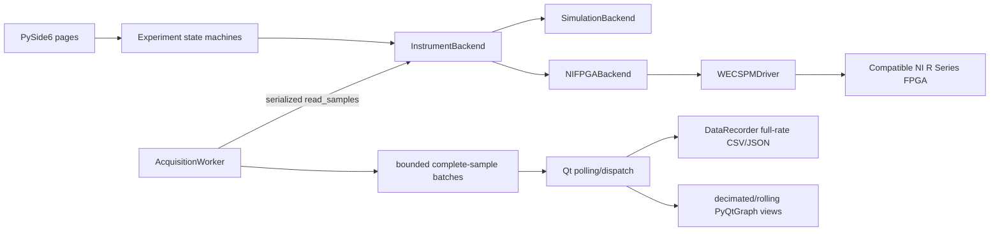
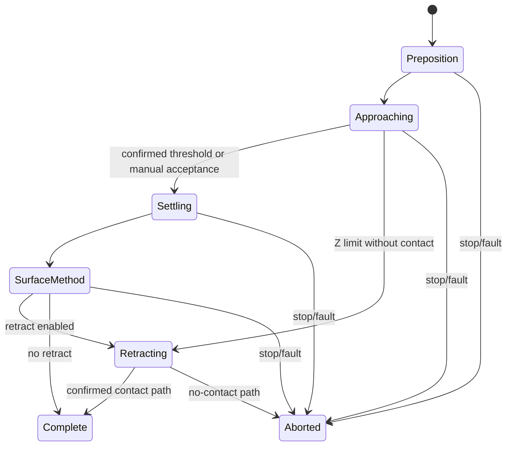

# Architecture and extension guide

eChemTips separates scientific method policy, deterministic FPGA protocol,
acquisition, persistence, and rendering. This boundary lets the same experiment
state machine run against a simulator or NI backend without putting device I/O
inside Qt widgets.

## Runtime data flow



All backend I/O is serialized by a re-entrant lock. `AcquisitionWorker` owns
continuous reads outside the GUI thread, queues complete batches, reports an
overflow instead of discarding data, and provides a pause/snapshot barrier for
stop or finalization. Qt dispatches each drained batch to the active experiment
and recorder; plots receive the same measurements through bounded display
buffers.

## Package responsibilities

| Module | Responsibility |
| --- | --- |
| `models.py` | Persisted settings, acquired sample model, method parameters, validation, and scan geometry/duration calculations. |
| `experiments.py` | Backend-independent method state machines and contact-gated stage transitions. |
| `backends.py` | Abstract instrument contract, deterministic simulator, NI session lifecycle, capability checks, and exception translation. |
| `ni_protocol.py` | `.lvbitx` inspection, deployed register/FIFO contract, raw/physical conversions, waypoint wire frame, and sample decoder. |
| `waypoints.py` | Common physical-unit CV, I–t, hold, simultaneous motion, and relative-Z plan compilation. |
| `host.py` | Execution snapshots, complete-frame FIFO streaming/refilling, and UI display buffer. |
| `ni_driver.py` | Single-owner FPGA program lifecycle, feedback/contact transitions, acknowledgements, refilling, watchdogs, context tags, and cancellation stream retirement. |
| `acquisition.py` | Background acquisition, bounded backlog, explicit errors, and final snapshot barrier. |
| `data.py` | Streaming CSV plus atomic/checkpointed JSON metadata and schema selection. |
| `ui.py`, `qt_common.py` | Operator pages, global ownership/actions, plots, maps, status, and persistent readback. |
| `analysis_core.py`, `legacy_data.py` | UI-independent loading, legacy normalization, and complete-CV extraction. |
| `analysis_window.py` | Analysis UI and cycle export. |
| `diagnostics.py` | Pure preflight/pipette calculations and JSON report persistence. |
| `hardware_check.py` | Explicit command-line bitfile/session contract check without normal experiment execution. |

## Experiment lifecycle

Approach-based methods use the common conceptual sequence:



`SurfaceMethod` is CV, I–t, or no additional method for standalone Approach.
Hopping repeats positioning → approach → settling → surface method → retract
for each physical grid point. A contact map is updated only from a confirmed
contact. End-of-travel is never promoted to contact.

On hardware, Python submits approach separately from the gated continuation.
The driver observes the FPGA feedback pause, acknowledges EndCurrentLine,
drains complete samples, resolves applied contact Z, and only then submits CV/
I–t/retract. This preserves the existing bitfile while preventing the historic
host-side ambiguity between contact and program completion.

## Ownership and terminal behavior

The UI allows one experiment/diagnostic or independent recording at a time.
The native driver independently allows one active waypoint owner. A program is
complete only after submitted/executed line agreement, an unpaused waiting
state, and final FIFO drain.

Normal contact completion keeps acquisition framing valid. Cancellation can
interrupt the target within a 14-word acquisition frame, so the driver retains
complete pre-stop samples, rejects residual post-stop words, latches the
session, and requires reconnection. Emergency Stop additionally asserts both
pause and stop controls. Neither operation promises zero downstream analog
output.

## Adding an experiment

1. Add a slotted parameter dataclass and complete validation in `models.py`.
   Keep UI units separate from protocol units; for example the UI converts pA
   to the model's nA boundary.
2. Express shared voltage/motion behavior with `PhysicalWaypoint` plan builders
   rather than manually constructing 14-word frames.
3. Add a backend-independent state machine in `experiments.py`. Make contact,
   end-of-travel, terminal state, and retract behavior explicit.
4. If hardware needs a specialized staged method, add it to the native driver
   through the shared owner/streamer/completion services. Do not open another
   NI session.
5. Expose only capability-supported backend methods; translate low-level errors
   into `BackendError` without losing the cause.
6. Add a `ManagedExperimentPage`, recording name mapping, plot dispatch, and
   finalization mapping in `ui.py`.
7. Add simulation state-machine, fake-NI protocol, recording, analysis, and Qt
   tests as applicable.
8. Update the operator guide, data/schema reference if fields change, and
   hardware commissioning procedure.

## Adding or changing hardware support

The public abstraction is `InstrumentBackend`. A complete backend must provide
connection lifecycle, sample acquisition, bounded motion, stop, and potential
commands. Capabilities tell the UI which live controls and full-rate readbacks
are real.

The built-in NI path owns the `nifpga.Session`; a driver created by
`create_driver(session, settings)` receives that already-open session and must
not download a bitfile or open a second session. The currently supported
WEC-SPM driver is the reference implementation. A site override selected by
`ECHEMTIPS_DRIVER_MODULE` is an advanced compatibility escape hatch, not a
shortcut around target validation.

A new bitfile/target requires:

- target identity and signature policy;
- complete register names, datatypes, access roles, startup values, and
  acknowledgement behavior;
- FIFO names, direction, element type, compiled depth, and frame layout;
- conversion formulas and overflow/range analysis;
- pause, feedback, completion, watchdog, stop, and partial-frame behavior;
- offline tests plus a staged physical commissioning procedure.

Do not add aliases based only on similar names. The current contract is detailed
in `HARDWARE_INTEGRATION.md`.

## Recording and analysis extension

The runtime `Sample` contains fields needed for control and display; the saved
schema intentionally selects a smaller subset. Change `DataRecorder` schema
only with a new documented schema version, round-trip tests, and an analysis
compatibility decision. Store scan-wide structure once in JSON rather than
repeating it in every high-rate CSV row.

Analysis calculations belong in `analysis_core.py` or another UI-independent
module. The Qt window should select inputs and render results, not define the
scientific extraction algorithm. Reject ambiguous/incomplete data explicitly.

## Test boundaries

The normal suite uses Simulation, temporary files, offscreen Qt, and fake NI
registers/FIFOs. It intentionally never connects to physical hardware. Run:

```bash
python -m unittest discover -v
python run_echemtips.py --smoke-test
python run_analysis.py --smoke-test
```

The bitfile checker is a separate explicit step. Physical validation follows
`REAL_HARDWARE_SETUP.md` and must record exact versions and evidence. See the
[public contribution guide](https://github.com/yerga/echemtips/blob/main/CONTRIBUTING.md)
for the review policy.
