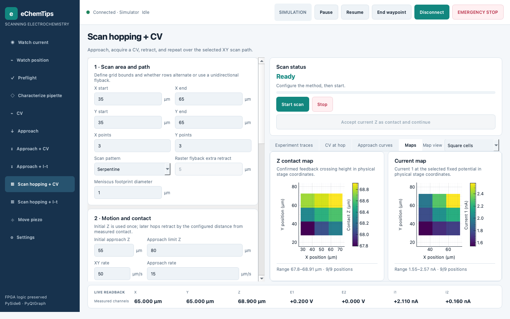
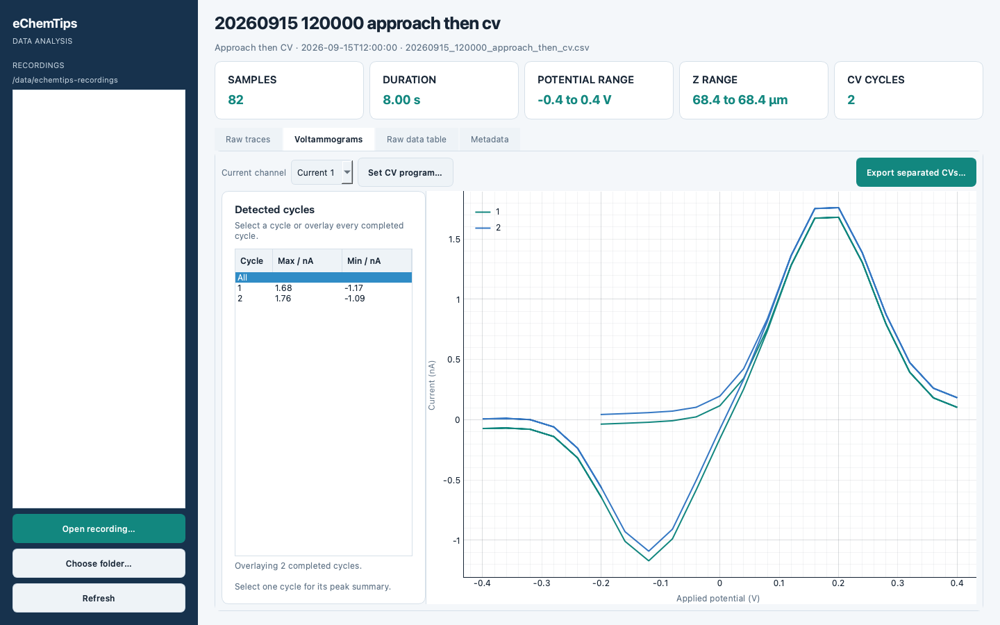

# Interface tour

The control application keeps method setup on the left, live results on the
right, connection and execution controls at the top, and measured instrument
values in a persistent strip at the bottom.



## Navigation

Experiment names and parameter labels are consistent across pages. Both hopping
methods use **Start scan** and **Stop experiment**. **Experiment traces** separates
time-domain data from **CV** or **I–t** results; scans show **CV at hop** or **I–t at hop**.

Use **ⓘ** beside a heading for background explanations (plot windows, recording
behavior and parameter interpretation). Hover for a tooltip or click/keyboard-
activate it for a persistent, wrapped help dialog. Essential setup instructions,
units, recording state and hardware safety warnings remain visible. The normal
hardware stop/reconnect behavior is unchanged.

- Select an experiment from the left sidebar. `Ctrl+1` through `Ctrl+9` open
  the first nine pages in sidebar order.
- **Connect** opens the simulator immediately. In NI FPGA mode it first shows
  the output-changing startup warning described in the commissioning guide.
- **Pause**, **Resume**, and **End waypoint** are low-level host controls and are
  enabled only when the backend advertises those capabilities.
- **EMERGENCY STOP** remains available at the top of every page.
- On scan pages, use **Experiment traces**, the method-specific hop tab,
  **Approach curves**, and **Maps** to separate long-running traces from local
  electrochemical results.
- Watch pages acquire and render only after **Start live view**. Moving to one
  of those pages does not replay data from another experiment.

The persistent bottom strip reports measured X, Y, Z, E1, E2, i1, and i2. It
does not present commanded position as measured position.

## Data analysis

The analysis application opens current recordings and supported legacy files.
Raw traces remain separate from detected CV cycles.



- **Raw traces** plots the entire source recording with selectable current
  channels and applied potential context.
- **Voltammograms** overlays completed CV cycles or shows one selected cycle and
  its current extrema.
- **Raw data table** previews up to 5,000 rows without changing the source.
- **Metadata** shows the JSON sidecar used to interpret method parameters and
  scan geometry.

For a legacy file without sufficient CV metadata, use **Set CV program…** and
enter the waveform that was actually commanded. This changes the in-memory
analysis interpretation; it does not rewrite the source file.

## Rebuilding the screenshots

Screenshots are deterministic simulator fixtures, not hardware evidence. From
the project environment run:

```bash
python scripts/capture_docs_screenshots.py
```

The script uses an isolated temporary settings path and the Qt offscreen
platform. It never opens the NI FPGA backend.
